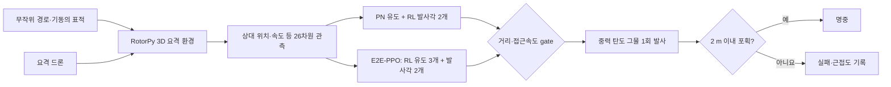
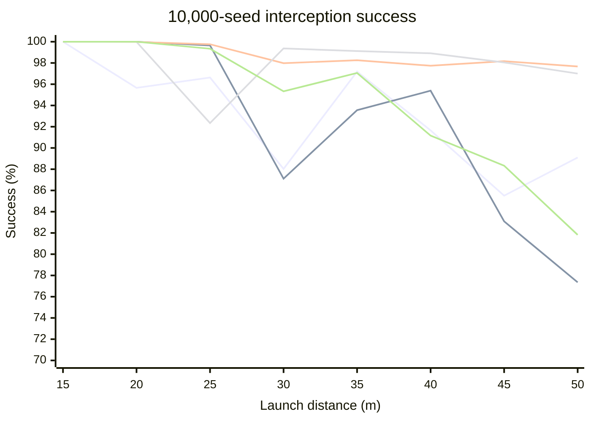

# RotorPy 기반 자율 드론 요격 연구

3차원 공역에 진입한 표적 드론을 요격 드론이 추적하고, 단 한 번 발사할 수 있는 그물로 포획하는 강화학습 연구입니다. 핵심 질문은 **물리 법칙에 따른 유도(PN)를 유지하면서 발사 방향만 학습하는 방식이 유도·조준을 모두 학습하는 방식보다 실용적인가**입니다.

## 1. 연구 목표

RotorPy의 쿼드로터 동역학을 사용하는 환경에서 비례항법(Proportional Navigation, PN) 유도와 강화학습 조준을 결합하고, PPO·A2C·DDPG·TD3·SAC를 같은 조건에서 비교합니다. E2E-PPO는 강화학습이 유도까지 맡을 때의 난도를 확인하는 예비 대조군입니다.

## 2. 연구 내용

### 시뮬레이션과 표적

- 공역은 반지름 100 m의 구이며, 표적과 요격기에는 같은 최대 속도 15 m/s, 최대 가속도 8 m/s², 최대 jerk 30 m/s³을 적용합니다.
- 두 기체에 RotorPy Crazyflie 모델을 사용합니다. 제어 간격은 0.05 s이고, 한 제어 step을 물리 계산 3회로 나눕니다.
- 표적은 구면의 무작위 지점에서 진입해 약 135° 떨어진 탈출 방향으로 이동합니다. 기준 속도는 8 m/s이며, 수평·수직 사인 기동과 시간적으로 상관된 OU 잡음을 더합니다. 기동 진폭·주파수와 경로는 episode마다 달라집니다.
- 그물의 발사속도는 요격기 기준 45 m/s입니다. 발사 후에는 중력을 받는 탄도체로 계산하며, 그물과 표적의 거리가 2 m 이내이면 포획 성공으로 판정합니다. Physics substep 사이를 통과하는 명중도 선분–구 교차로 검사합니다.

### 유도·발사 결정



| 구분 | PN + RL 조준: 주 실험 | E2E-PPO: 예비 대조군 |
|---|---|---|
| 유도 가속도 | PN + 8 m/s 속도 추종 규칙 | RL이 LOS 기준 3축 가속도 결정 |
| 발사 시점 | 공통 규칙 기반 gate | 공통 규칙 기반 gate |
| 발사 방향 | RL이 LOS 기준 좌우·상하각 결정 | RL이 LOS 기준 좌우·상하각 결정 |
| Action 차원 | 2 | 5 |

발사 gate는 매 제어 step에 검사합니다. **표적–요격기 거리 ≤ 설정 발사거리**이면서 **closing speed ≥ 5 m/s**가 되는 첫 순간 자동 발사합니다. 발사각 범위는 LOS 기준 좌우 ±30°, 상하 ±20°입니다. 주 실험은 발사거리를 15–50 m에서 5 m씩 바꾸고, 각 거리·알고리즘 조합을 독립적으로 학습했습니다.

관측값은 상대 위치·속도, 요격기의 위치·속도·자세·각속도·직전 가속도, 경과시간, 발사 여부, gate 및 curriculum 단계로 이루어진 **26차원 ground-truth 상태**입니다. 표적 기동의 숨은 진폭·주파수·OU 상태는 직접 제공하지 않습니다. 일반 step에는 거리 진전과 시간 감점, 명중에는 시간 보너스, 실패에는 페널티와 그물–표적 최소거리에 따른 near-miss 항을 적용합니다. 명중·실패·공역 이탈은 `terminated`; 개발용 step 제한만 `truncated`로 구분합니다.

## 3. 평가 결과

다음은 **학습 seed 0**, 거리별 최고 검증 checkpoint를 별도의 **10,000개 평가 seed(20,000–29,999)**에서 시험한 명중률입니다. 학습 중에는 고정된 20개 seed로 5,000 step마다 평가하고, 95% 이상이 10회 연속이면 조기 종료했습니다. 최대 학습 예산은 조합당 400만 환경 step입니다.

| 알고리즘 | 15 m | 20 m | 25 m | 30 m | 35 m | 40 m | 45 m | 50 m |
|---|---:|---:|---:|---:|---:|---:|---:|---:|
| PPO | 100.00 | 95.66 | 96.63 | 88.03 | 97.19 | 91.65 | 85.51 | 89.10 |
| A2C | 100.00 | 100.00 | 99.65 | 87.11 | 93.56 | 95.39 | 83.09 | 77.35 |
| DDPG | 100.00 | 99.98 | 99.76 | 97.98 | 98.26 | 97.74 | 98.17 | 97.67 |
| TD3 | 100.00 | 99.99 | 92.34 | 99.37 | 99.12 | 98.91 | 98.05 | 97.00 |
| SAC | 100.00 | 100.00 | 99.34 | 95.33 | 97.06 | 91.16 | 88.33 | 81.82 |

단위: %. 아래 그래프는 위 표와 동일한 데이터입니다.



DDPG와 TD3는 50 m에서도 각각 97.67%, 97.00%를 기록했습니다. SAC는 35 m 이후 명중률이 낮아졌으며, PPO·A2C의 장거리 결과도 거리별로 변동했습니다. 거리마다 별도 모델을 학습했으므로 성공률이 반드시 단조감소하지는 않습니다. **단일 학습 seed의 결과이고, 검증 checkpoint 선택에는 20개 고정 seed를 썼으므로 알고리즘의 일반적 우열이나 성능 차이의 원인을 확정할 수는 없습니다.** E2E-PPO는 예비 실험으로만 다루며 위 거리별 표에는 포함하지 않았습니다.

## 4. 재현 및 한계

```bash
python -m pip install -r requirements.txt
python train.py --mode pn --physics-engine rotorpy --sanity
python train.py --agent ppo --mode pn --launch-distance 30 --seed 0 --physics-engine rotorpy
python evaluate.py --agent ppo --mode pn --launch-distance 30 --training-seed 0 --checkpoint stage1_best --seed-start 20000 --num-seeds 10000 --physics-engine rotorpy
```

`config.py`는 공통 물리·보상·평가 조건, `interception_env.py`는 환경·표적·PN·그물, `agent/`의 각 파일은 해당 알고리즘과 하이퍼파라미터를 담습니다. `train.py`는 학습, `evaluate.py`는 저장된 모델 평가, `record.py`는 궤적·영상 기록에 사용합니다. 학습 산출물 `runs/`는 저장소에 포함하지 않습니다.

현재 연구는 시뮬레이터의 ground-truth 관측과 추상화된 단발 그물을 사용합니다. 실제 센서 오차, 그물 전개·접촉 물리, 하드웨어 실험은 포함하지 않으므로 실기체 성능으로 바로 해석할 수 없습니다.
